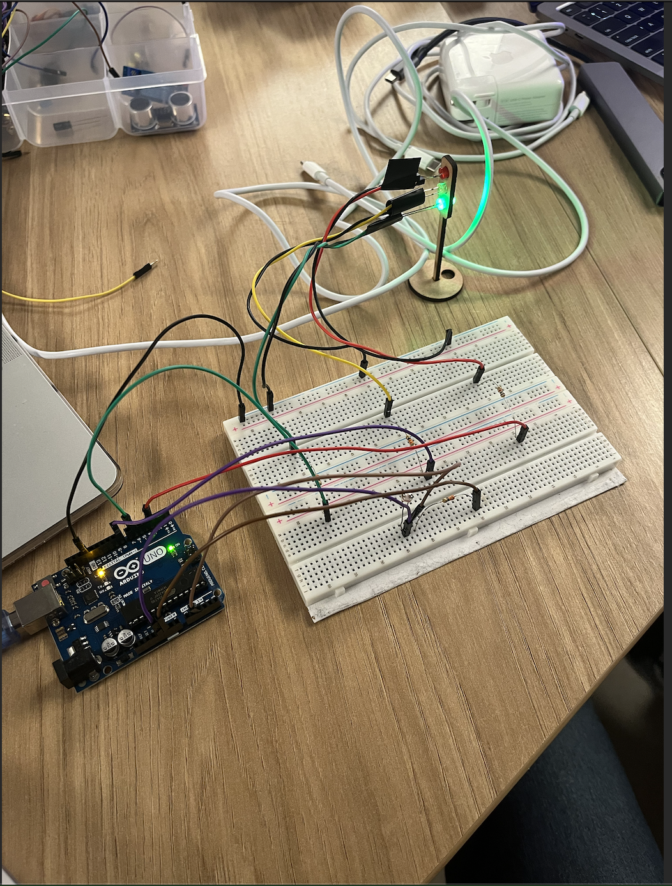

# Projeto de Semáforo com Arduino

**Vinicius Maciel Flor**

---

## Introdução

O objetivo deste projeto é desenvolver um sistema de semáforo simplificado utilizando componentes básicos de eletrônica, como LEDs e resistores, e controlar seu comportamento através de programação em Arduino. A montagem visa simular o funcionamento de um semáforo convencional, com temporizações determinadas para cada fase de operação. Como adicional, coloquei um sensor de luminosidade que quando a iluminação fica acima de 20, o sinal fica sempre verde.

---

## Materiais Utilizados

| Componente   | Especificação | Função no Circuito                              |
|--------------|---------------|-------------------------------------------------|
| LED Verde    | 5mm, 2V       | Representa a luz de "Siga"                      |
| LED Amarelo  | 5mm, 2V       | Representa a luz de "Atenção"                   |
| LED Vermelho | 5mm, 2V       | Representa a luz de "Pare"                      |
| Resistores   | 220Ω          | Limita a corrente para proteção dos LEDs        |
| Sensor de Luz| LDR           | Detecta o nível de luminosidade ambiente        |
| Arduino Uno  | -             | Controlador para gerenciar a lógica do sistema  |
| Protoboard   | -             | Plataforma para montagem dos componentes        |
| Jumpers      | -             | Conexão entre componentes e Arduino             |

---

## Montagem do Circuito

A montagem foi realizada em uma protoboard conectada ao Arduino Uno. Os LEDs foram distribuídos com resistores em série para cada cor, garantindo a proteção dos componentes. As portas digitais do Arduino foram configuradas da seguinte maneira:

1. **LED Verde**: Conectado à porta digital 6, em série com um resistor de 220Ω.
2. **LED Amarelo**: Conectado à porta digital 8, em série com um resistor de 220Ω.
3. **LED Vermelho**: Conectado à porta digital 3, em série com um resistor de 220Ω.
4. **Sensor de Luz (LDR)**: Conectado à entrada analógica A2 para detecção da intensidade de luz ambiente.

As conexões foram organizadas para garantir clareza e facilitar a visualização da montagem física. A foto da montagem está incluída abaixo.

---

## Código C++

```cpp
const int sensorPin = A2; 
const int greenPin = 6;    // Porta digital para o LED verde
const int redPin = 3;      // Porta digital para o LED vermelho
const int yellowPin = 8;   // Porta digital para o LED amarelo
int threshold = 20;

void setup() {
  pinMode(greenPin, OUTPUT);  // Define o pino do LED verde como saída
  pinMode(redPin, OUTPUT);    // Define o pino do LED vermelho como saída
  pinMode(yellowPin, OUTPUT); // Define o pino do LED amarelo como saída
  Serial.begin(9600);        // Inicializa a comunicação serial para monitorar os valores do sensor
}

void loop() {
  int sensorValue = analogRead(sensorPin);  // Lê o valor do sensor de luz
  Serial.println(sensorValue);          // Mostra o valor do sensor no monitor serial (opcional)

  // Verifica se está escuro
  if (sensorValue < threshold) {
    // Apaga o LED verde e acende o LED amarelo
    digitalWrite(greenPin, LOW);
    digitalWrite(yellowPin, HIGH);
    delay(4000);  // Espera 4 segundos no amarelo

    // Apaga o LED amarelo e acende o LED vermelho
    digitalWrite(yellowPin, LOW);
    digitalWrite(redPin, HIGH);
    delay(6000);  // Espera 6 segundos no vermelho

    // Após o ciclo, volta ao LED verde
    digitalWrite(redPin, LOW);
    digitalWrite(greenPin, HIGH);
  } else {
    digitalWrite(greenPin, HIGH);
    digitalWrite(redPin, LOW);
    digitalWrite(yellowPin, LOW);
  }

  delay(500);
}

```

## Imagens do Projeto



### Sobre o vídeo, o drive não está funcionando por algum motivo, mas você viu na aula que estava funcionando então se puder considerar agradeço rsrs. 

https://drive.google.com/file/d/1pVh4zqQxKQCSoyim-XHhp1UfFopdXwXT/view?usp=sharing

# Template Avaliação Pares

### Avaliador: Giacomo Zema Matizonkas

| Critério                                                                                                 | Contempla (Pontos) | Contempla Parcialmente (Pontos) | Não Contempla (Pontos) | Observações do Avaliador |
|---------------------------------------------------------------------------------------------------------|--------------------|----------------------------------|--------------------------|---------------------------|
| Montagem física com cores corretas, boa disposição dos fios e uso adequado de resistores                | 3                  |                                  | 0                        | Montagem bem organizada e cores dos fios apropriadas. |
| Temporização adequada conforme tempos medidos com auxílio de algum instrumento externo                  | 3                  |                                  | 0                        | Temporização de acordo com os tempos previstos. |
| Código implementa corretamente as fases do semáforo e estrutura do código (variáveis representativas e comentários) | 3                  |                                  | 0                        | Estrutura do código clara, com variáveis bem nomeadas. |
| Extra: Implementou um componente de liga/desliga no semáforo e/ou usou ponteiros no código              | 1                  |                                  | 0                        | Adicionou recurso extra de forma funcional. |
|                                                                                                         |                    |                                  |                          | **Pontuação Total: 10** |

---

# Template Avaliação Pares

### Avaliador: Fernando Bertholdo

| Critério                                                                                                 | Contempla (Pontos) | Contempla Parcialmente (Pontos) | Não Contempla (Pontos) | Observações do Avaliador |
|---------------------------------------------------------------------------------------------------------|--------------------|----------------------------------|--------------------------|---------------------------|
| Montagem física com cores corretas, boa disposição dos fios e uso adequado de resistores                | 3                  |                                  | 0                        | Organização da montagem muito boa, com cores adequadas. |
| Temporização adequada conforme tempos medidos com auxílio de algum instrumento externo                  | 3                  |                                  | 0                        | Tempos ajustados com precisão. |
| Código implementa corretamente as fases do semáforo e estrutura do código (variáveis representativas e comentários) | 3                  |                                  | 0                        | Código organizado e de fácil entendimento. |
| Extra: Implementou um componente de liga/desliga no semáforo e/ou usou ponteiros no código              | 1                  |                                  | 0                        | Extra implementado corretamente. |
|                                                                                                         |                    |                                  |                          | **Pontuação Total: 10** |
